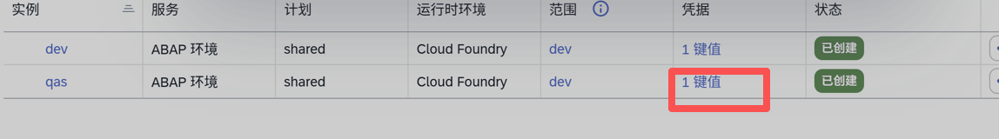

# SAP BTP ABAP ADT MCP Server

这是一个基于 Python、FastMCP 和 ASGI 的 SAP ABAP ADT MCP 服务端，面向实际开发场景。

当前能力：

- 浏览器 SSO 登录 ADT
- ABAP Repository 搜索
- 源码和元数据读取
- 受控创建、修改、激活、删除
- OData V4 Service Binding 发布

## 运行要求

- Python 3.11+
- 目标 SAP ABAP 系统已启用 ADT
- 可以通过浏览器完成 SSO 登录
- 对需要修改的对象类型具备后端开发权限

安装依赖：

```powershell
python -m venv .venv
.\.venv\Scripts\pip install -e ".[test]"
```

## HTTP 端点

- `/mcp`
- `/healthz`
- `/logon/success`

## MCP Tools

- `abap_adt_login`
- `abap_save_sso_session`
- `abap_save_sso_cookie_header`
- `abap_adt_connect`
- `abap_search_objects`
- `abap_read_source`
- `abap_create_object`
- `abap_update_source`
- `abap_activate_object`
- `abap_delete_object`
- `abap_publish_service_binding`

## 当前支持范围

以下对象类型都支持读取、创建、修改、删除：

- `CLAS`、`INTF`
- `DDLS`、`DCLS`、`BDEF`、`DDLX`、`SRVD`、`SRVB`
- `TABL`、`DTEL`、`DOMA`、`DEVC`
- `PROG`、`FUGR`、`FUNC`

补充说明：

- Class 和 Interface 读取会自动聚合 local includes，例如 `definitions`、`implementations`。
- 只要 `readable_packages` 允许，就可以读取 SAP 标准包对象；但 SAP 标准对象在正常使用中应保持只读。
- 创建、修改、激活、发布、删除操作始终受 `allowed_packages` 限制。
- MCP 只负责发起 ADT 请求，最终是否允许修改仍由 SAP 后端权限和对象限制决定。

## 配置

复制示例配置：

```powershell
copy sap-mcp.example.yaml sap-mcp.yaml
```

示例：

```yaml
server:
  name: "SAP BTP ABAP ADT MCP Server"
  auth_tokens:
    - "dev-token"

abap_dev:
  system_url: "https://your-abap-instance.abap.region.hana.ondemand.com"
  callback_url: "http://localhost:8000/logon/success"
  reentrance_endpoint: "/sap/bc/sec/reentrance"
  reentrance_scenario: "FTO1"
  service_key_path: "service-key.json"
  session_path: ".sap-mcp-session.json"
  readable_packages:
    - "*"
  allowed_packages:
    - "Z*"
  allow_write: false
  allow_activate: false
  default_timeout_seconds: 30
```

安全建议：

- `service-key.json` 只用于在未显式配置 `system_url` 时解析系统地址。
- 不要分发 `.sap-mcp-session.json`、`service-key.json`、`.env`、真实的 `sap-mcp.yaml`。
- 正式使用建议保持 `readable_packages: ["*"]`，并把 `allowed_packages` 收紧到自开发包。

## service-key.json 来源

如果没有在 `abap_dev.system_url` 中直接配置系统地址，MCP 可以从本地 `service-key.json` 里读取 ABAP 实例 URL。

在 SAP BTP Cockpit 中通常这样获取：

1. 打开 `实例和租用`
2. 找到你的 ABAP 环境实例
3. 点击凭据列里的 `1 键值`
4. 在弹窗中点击 `下载`，把下载得到的服务键值 JSON 保存为本地 `service-key.json`

下面这张图只用于说明从哪里进入下载服务键值 JSON：



## 启动

```powershell
$env:SAP_MCP_AUTH_TOKENS="dev-token"
uvicorn app.server:app --host 127.0.0.1 --port 8000
```

## 登录流程

1. 调用 `abap_adt_login`
2. 在浏览器中完成 SAP SSO
3. 本地 `/logon/success` 回调保存 ADT reentrance session
4. 调用 `abap_adt_connect` 验证连接
5. 先读后写，只有在确实需要时才打开 `allow_write` 和 `allow_activate`

## 测试

```powershell
python -m pytest -q
```
